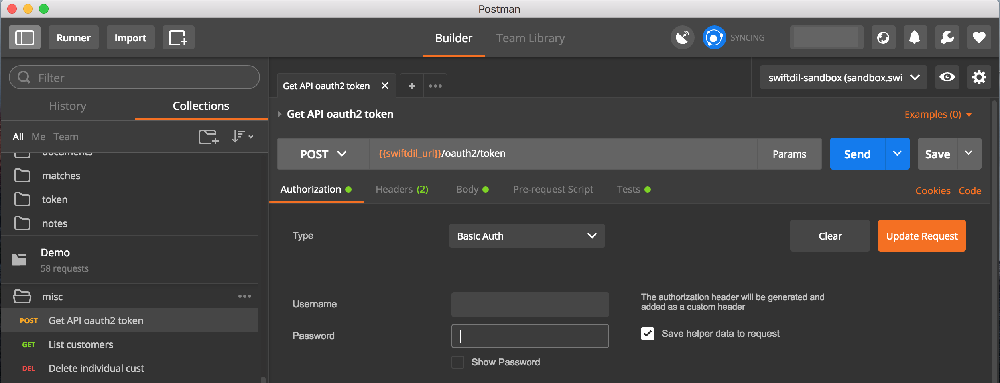
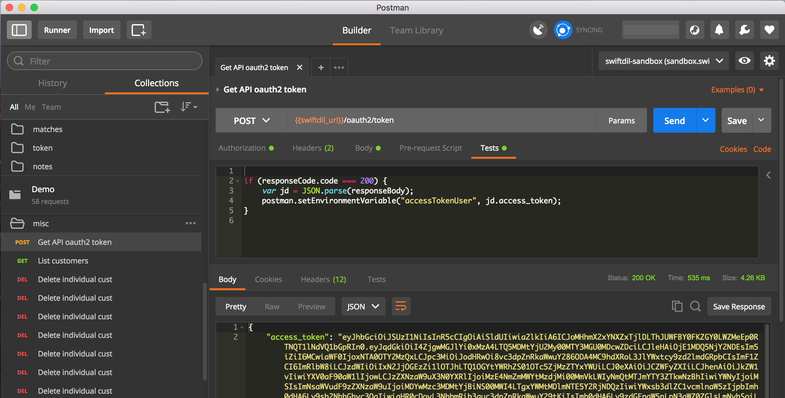
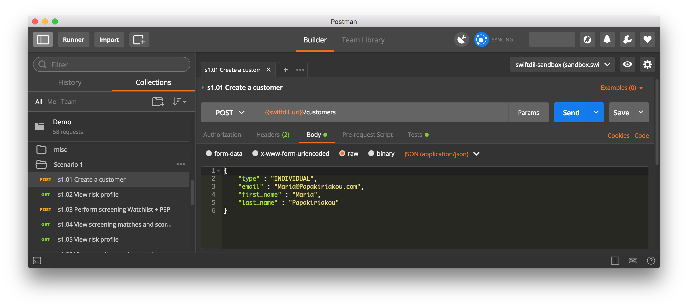
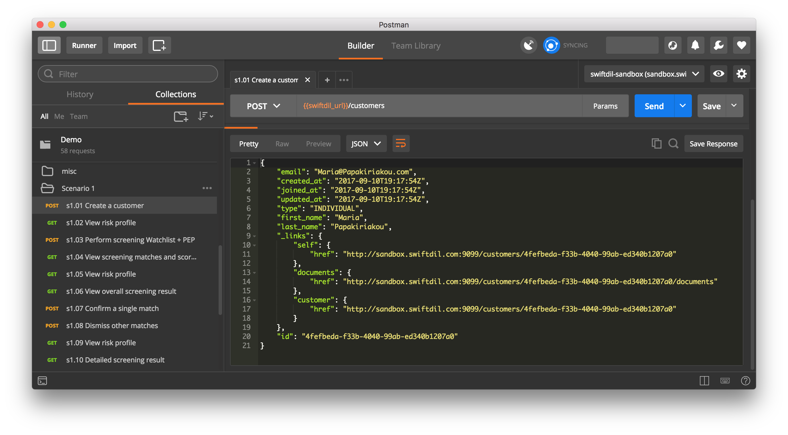
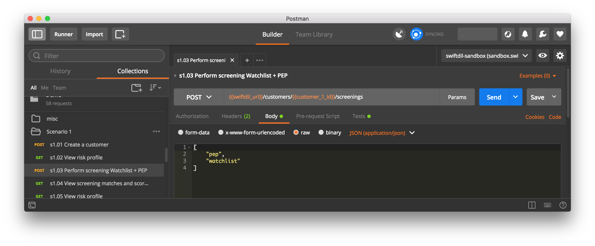
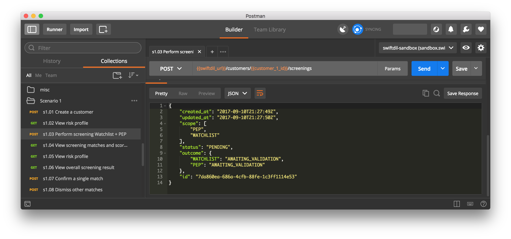
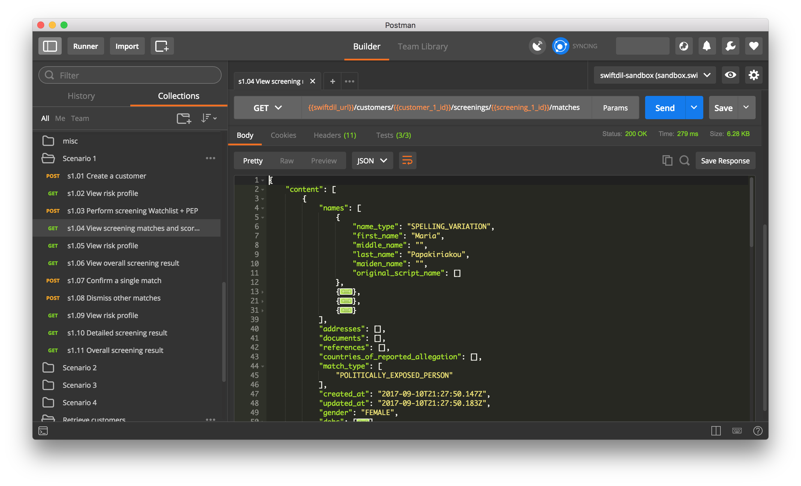
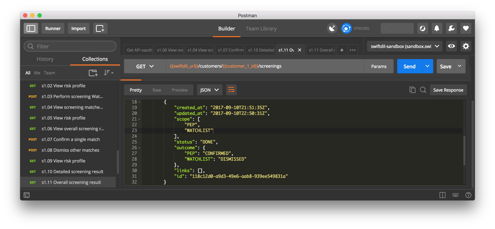

# Introduction
The [SwiftDil](https://www.swiftdil.com) API is designed for businesses that would like to automate their Know Your Customer (KYC) and Anti-Money Laundering (AML) processes.

Our API endeavours to adhere to RESTfull principles and returns JSON for all responses including errors. For further information on the API, please refer to our [API Reference](https://reference.swiftdil.com).

We designed our API demo to run with Postman, a REST client which helps making API calls with ease. We used Version 5.2.0 of Postman for this guide. However, the steps described below should be compatible with earlier or later Postman versions.

In order to use the API demo, you **must obtain Sandbox API Credentials** by completing the [Sandbox Access Form](https://www.swiftdil.com/#sandbox) on our website.

PS. We recommend that you consult our [step-by-step guide](https://docs.swiftdil.com) as it provides a quick walkthrough of the capabilites of our API.

# Postman Setup
To download Postman, simply follow the instructions found in [GetPostman.com](https://GetPostman.com).

<!---->

<p align="center">
  
</p>

# Envirenment Setup
Setting up an environment allows us to easily use environmental variables, which make calling to the API easier, and quicker e.g. reusing resource IDs when running sequential API calls such as:

**Create customer → Update Customer → Screen Customer → View Risk Profile**.

To make it easier for you, we have created a [Sandbox environment](/colllections/swiftdil-sandbox-postman-environment.json) which can easily be imported. To do so, click on **Environment Options** (cog icon), then click on **Manage Environments**.

<p align="center">
  
</p>

Select the **Manage Environments** tab, then click import and select the [Sandbox environment](/colllections/swiftdil-sandbox-postman-environment.json).

<p align="center">
  
</p>

Your environment is now ready.

<p align="center">
  
</p>

To use the Sandbox environment, close the **Manage Environment** window, then select the `swiftdil-sandbox` from the **Environment** dropdown.

<p align="center">
  
</p>

You are now ready to import the collection.

# Collections
Postman collections allow the grouping of API calls and thus automate the process of using our platform. We provide a couple of official Postman collections to help you get started testing as soon as possible:

* **[The Demo Collection](/collections/swiftdil-demo.json)** is designed to provide you with a quick overview of the SwiftDil API using a set of scenario-cratfed API calls. 

* **[The API Collection](/collections/swiftdil-api.json)** is designed to provide you with a quick template for all available SwiftDil API calls.

To import our official Postman collections, click on the **Import** button in the top left corner, then select **Import File** tab.

<p align="center">
  
</p>

Then, select **Choose Files** and import the [Demo](/collections/swiftdil-demo.json) and [API](/collections/swiftdil-demo.json) collections. Once imported, you should be able to see both collections under the **Collections** tab.

<p align="center">
  
</p>

# How to Use These Collections?

Using Postman with the SwiftDil API is similar to making manual HTTP requests e.g. using [cURL](https://curl.haxx.se), only easier. 

## Authenticate
Before you can use the API, you need to authenticate yourself. The API will validate your clientid/username and API key, and return an authentication token if you are successfully authenticated. This token will need to be sent in the header of all subsequent calls to the API.

We have created an environment variable (i.e. `accessTokenUser`) to hold the token for you. 

Click on **_Get API oauth token_** API call in the **misc** folder of the Demo collection. Then provide your Username and the Password under the Authorisation tab using **Basic Auth**. 

<p align="center">
  
</p>

Click on **Send** and you should get a response back with your access token.

<p align="center">
  
</p>

You will notice that there is a script under the **Tests** tab which saves the access token into an environment variable called `accessTokenUser`.

```js
if (responseCode.code === 200) {
    var jd = JSON.parse(responseBody);
    postman.setEnvironmentVariable("accessTokenUser", jd.access_token);
}
```

## Create Customer

To create a sample _individual_ customer, only 4 attributes  are required, as illustrated by the sample call below.  However, the richer imformation you provide about your customer, the more accurate our matching engine will be.

<p align="center">
  
</p>

The screenshot below shows the REST JSON response for newly-created customer along with its `id`.

<p align="center">
  
</p>

In the same fasion as with the **Authenticate** call, you will notice that there is a script under the **Tests** tab which saves the customer `id` into a postman variable called `customer_1_id`:

```js
if (responseCode.code === 201) {
    var jd = JSON.parse(responseBody);
    postman.setEnvironmentVariable("customer_1_id", jd.id);
}
```

Saving Postman variables in this way is a partten we follow for the subsequent AP calls but will be ommitted from this point onwards for brevity.

## Screen Customer

To perform a screening, all you need to specify is the scope of the desired screening as illustrated below

<p align="center">
  
</p>

Result of the customer screening

<p align="center">
  
</p>

The screening shows:

* The requested scope of the screening at hand.
* The current status of the screening at hand.
* The outcome of the screening per scope e.g. AWAITING_VALIDATION for a given scope indicates there are potential screening matches which require manual validation.

## Review Matches

A screening request may result in one or multiple matches. A match is determined by SwiftDil’s fuzzy scorecard logic and pre-defined thresholds. The matches API allows you to retrieve, review, and validate matches relating to a given screening request. The validation of a potential match refers to either the confirmation or dismissal of the match once you have reviewed the details at hand.

Please execute **View Screening Matches** API call to view the list of potential matches identified by SwiftDil Matching Engine.

<p align="center">
  
</p>


One all the matches have been validated (i.e. confirmed and/or dismissed), the screening object is update accordingly.

<p align="center">
  
</p>


## Conclusion

We hope this short guide got you quickly playing with our API. This guide does not cover all the functionality offered by SwiftDil as it is intended as a _Quick Start_ guide.

We invite you to continue playing with the Demo and API collections whilst refering to our [API Guide](https://docs.swiftdil.com) and [API Reference](https://reference.swiftdil.com) as and when needed.

Should you need any help, please do not hesitate to conatct our friendly [Support Team](https://www.swiftdil.com/#contact).


