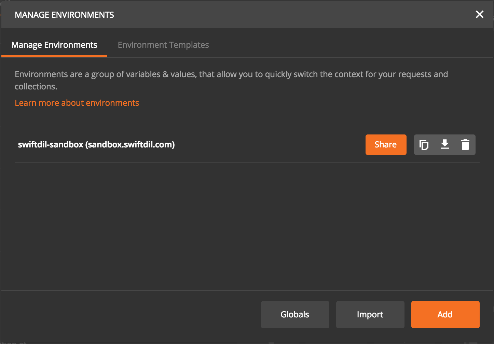

# Introduction
The [SwiftDil](https://www.swiftdil.com) API is designed for businesses that would like to automate their Know Your Customer (KYC) and Anti-Money Laundering (AML) processes. Our API endeavours to adhere to RESTfull principles and returns JSON for all responses including errors. For further information on the API, please refer to our [API Reference](https://reference.swiftdil.com).

We designed our API demo to run with Postman, a REST client which helps you make API calls with ease. We used Version 5.2.0 of Postman for this guide. However, the steps described below should be compatible with earlier or later Postman versions.

In order to use the API demo, you **must obtain Sandbox API credetials** by completing the [Sandbox Access Form](https://www.swiftdil.com/#sandbox) on our website.

# Postman Setup
To download Postman, simply follow the instructions found in [GetPostman.com](https://GetPostman.com).

<!---->

  

# Envirenment Setup
Setting up an environment allows us to easily use environmental variables, which make calling to the API easier, and quicker e.g. reusing resource IDs when running sequential API calls such as: **create customer → update customer → screen customer**.

To make it easier for you, we have created a [Sandbox environment](colllections/SwiftDil-sandbox.postman_environment.json) which can easily be imported. To do so, click on **Environment Options** (cog icon), then click on **Manage Environments**.

<!---->

  

Select the **Manage Environments** tab, then click import and select the [Sandbox environment](colllections/SwiftDil-sandbox.postman_environment.json).

  

Your environment is now ready.

  

Close the Manage Environment window, then select the sandbox environment.

  

You are now ready to import the collection.

# Collections
Postman collections allow the grouping of API calls and thus automate the process of using our platform. We provide a couple of official Postman collections to help you get started testing as soon as possible:

* **[The Demo Collection](collections/swiftdil-demo.json)** is designed to provide you with a quick overview of the SwiftDil API using a set of scenario-cratfed API calls. 

* **[The API Collection](collections/swiftdil-api.json)** is designed to provide you with a quick template for all available SwiftDil API calls 

To import our official Postman collections, click on the **Import** button in the top left corner, then select **Import File** tab.

  

Then, select **Choose Files** and import the [Demo](collections/swiftdil-demo.json) and [API](collections/swiftdil-demo.json) collections.Once imported, you should be able to see both collections under the Collections tab.

  

